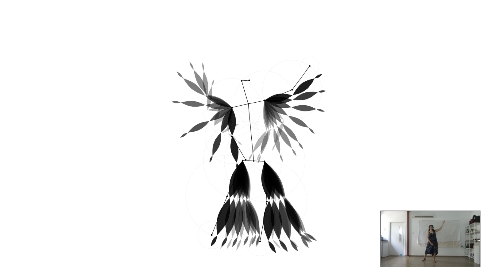
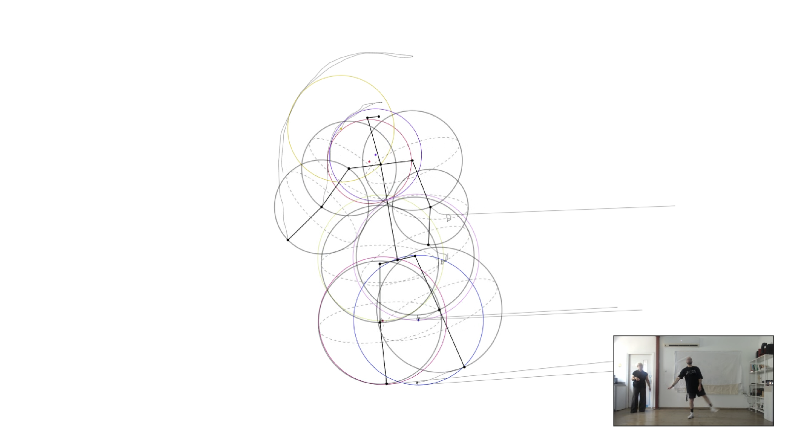
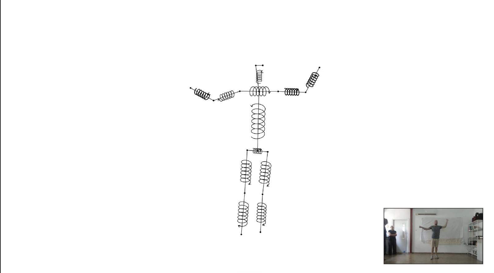
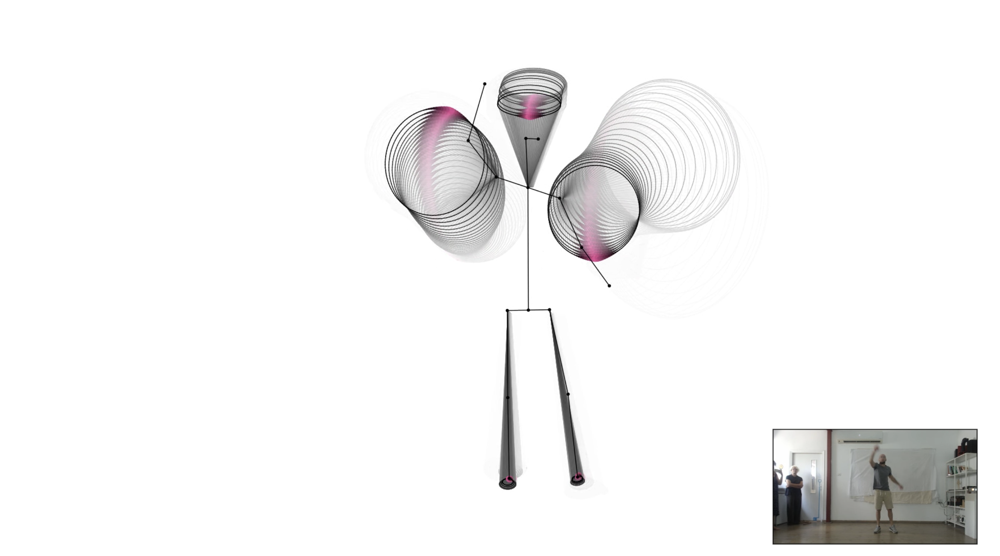
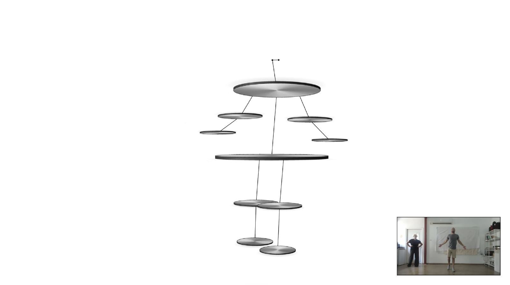

# Movement Notation

An interface that invites you to move, and draws your movement as live
movement notation.

The camera reads your body, and five figures draw it in turn, twenty
seconds each. Each figure is a different notation language for the same
body: each one chooses a different axis of movement to emphasise, and
leaves the rest out.

---

## Background

The project is **inspired by Eshkol-Wachman Movement Notation**, developed
in Israel by Noa Eshkol and Avraham Wachman and published in 1958.

The notation was created to give movement a writing system: a way to read
and write a sequence of movements, the way music is read and written. It
has been used in choreography, in the teaching of physical education, and
elsewhere.

To build it, Eshkol and Wachman took movement apart and analysed it as the
displacement of joints within a three-dimensional coordinate system. That
is what led this project to MediaPipe, which returns exactly that: joints
as coordinates in space, frame after frame.

What this project takes is not the notation but **the research that
preceded it**, the work of characterising the different modes in which a
human body moves: vertical, lateral, rotational, radial. That
characterisation is what the five figures are built around. Each figure
takes one mode and draws only that.

And that is the move the project makes: an inquiry that ended in a
written, after-the-fact system becomes an interactive interface, drawn in
front of you, from your own body, as you move.

## The research question

**How does graphic output shape the movement of the person producing it?**

And, more specifically: when the figure changes, and each one
emphasises a different aspect of movement, how does that change the
user's behaviour in real time?

Every figure is a different proposition about which movement matters. The
cones reward widening circles. The plates reward depth, toward the camera
and away from it. The circles reward crossing specific angles. Nothing
tells the user this. The graphic does, by responding richly to one kind
of movement and staying quiet for the rest.

The cycle is what makes this observable: twenty seconds each, five
figures, no explanation in between. What the body does in the seconds
after a switch is the finding.

This is why smoothness became the measure for every technical decision
here. Not "is this accurate" but "does this make someone raise their arm
and turn it faster". A figure that responded correctly but in a
stuttering way failed the test; stuttering discourages movement instead
of inviting it, and a graphic that discourages movement cannot answer the
question.

## The five figures

| | Figure | What it emphasises |
|---|---|---|
| 1 | Feathers | The vertical axis: sweeps up and down, leaving a fading trail |
| 2 | Circles | Angle crossings: a coloured stamp is printed at 90° and 180° |
| 3 | Spirals | Rotation around the limb's own axis |
| 4 | Cones | Conical movement: widening circles around the limb's axis |
| 5 | Plates | The horizontal plane and depth: toward and away from the camera |

The body itself is identical in all of them: same skeleton, same line
weight, same joint points. Only the space built around it changes. That
is what makes them five views of one thing rather than five separate
projects.



*Feathers. Every limb leaves a fan of petals behind it, one sampled every
150 milliseconds, fading out over four and a half seconds. Sweeping up and
down builds the fan; holding still lets it empty.*



*Circles. A faint circle follows each limb segment, its radius the reach of
that segment. Every time a joint angle crosses 90 or 180 degrees a coloured
circle is stamped onto the canvas and stays there, so twenty seconds of
movement accumulates into a field.*



*Spirals. A compressed helix is wound around the middle of every bone. It
spins in the direction the bone travels along its own axis, and the
arrowhead sits on whichever end is leading.*



*Cones. One cone per limb, its apex at the shoulder or hip and its rim a
real circle in space around the hand or foot. The wider the circle the hand
describes, the wider the cone opens. The pink swelling on the rim marks
where the hand is at this moment.*



*Plates. Every joint carries a plate lying parallel to the floor. The
pelvis plate is the horizon line: plates near it are seen edge on, and the
further above or below it they sit the more they open. Moving toward and
away from the camera spins the light across them.*

## How the body arrived at its form

It did not start there. The first figures were fully drawn characters,
assembled from SVG files and animated with p5.js; each one its own
illustration, with its own body. That stayed at the sketch stage; none of
it survives in the final product.

Then came a three-dimensional stage, built with three.js, with real
lighting and camera angles. It was dropped for a reason worth stating: it
put the attention on the figure. A lit, dimensional body is interesting to
look at in its own right, and it pulled the eye away from the graphic
expression of the movement, which is the entire subject.

The shared skeleton came last: points and lines, nothing more, drawn on a
2D canvas and identical in all five. The thinking was that graphic
uniformity in the body is exactly what allows graphic variety everywhere
else. With the skeleton held constant, each figure can differ sharply in
its language and in its character while the whole remains a consistent
design system: one interface, not five separate pieces.

---

## Working with MediaPipe

Detection uses [MediaPipe Pose](https://developers.google.com/mediapipe),
which returns 33 body landmarks from each camera frame. Most of the work
was not in the detection itself but in what happens after it.
Characterising what the detection actually does, where it is steady and
where it is not, was part of the research rather than a detour from it.
Three of its behaviours shaped every decision that followed.

### Detection arrives more slowly than the screen draws

MediaPipe delivers a pose roughly 15 to 20 times per second, while the
screen refreshes 60 times. Drawing only when a new pose arrives therefore
makes every update a visible step.

It shows most in the cones, because the ring sits far from the shoulder
and acts as a lever: a small angular step at the shoulder becomes a jump
of tens of pixels at the rim. At one rotation per second, that is a jump
of about 38 pixels per update.

So drawing was separated from detection. The incoming pose is kept as a
target, and a render loop running at screen rate eases the displayed body
toward it. The average jump dropped by a factor of four. The cost is a few
hundredths of a second of added latency: worth paying, because smooth
motion matters here more than instant response.

### The depth axis moves in ways the body does not

MediaPipe returns depth as well, the z axis, but it is its least stable
channel: the value shifts even when the body is still. Any geometry that
leans on it directly picks up that shift and shakes.

So z is used only where the instability is tolerable. It sets the
**direction** in which the ellipses tilt, never their size or their
position, and everything derived from it is heavily smoothed and updates
slowly.

### The two ends of a cone do not carry equal weight

A cone has its apex at the shoulder and its ring at the wrist. A tremor at
the apex moves the ring twice: once by displacing the whole shape, and
again by rotating the axis around it, while a tremor at the tip moves it
once. The apex is the lever.

So the two points are smoothed at different rates, with the apex held far
steadier than the tip. That cut the shake by nearly a factor of seven,
without costing any responsiveness at the hand.

---

## Code structure

```
index.html      the interface: camera, detection, figure cycle, recording
skeleton.js     the shared skeleton: line weight, colour, joint points
figure1.html    feathers
figure2.html    circles
figure3.html    spirals
figure4.html    cones
figure5.html    plates
```

**The camera and the detection engine run exactly once**, in the
interface. The five figures sit in preloaded frames, and each exposes a
single function that receives the body landmarks. It is the same
interface each figure has when opened on its own, so every figure stays
a standalone file that can be opened, edited and tested independently,
with no duplicate copy to keep in sync.

---

## Running it

**Live: [shaharlondon.github.io/Movement-notation](https://shaharlondon.github.io/Movement-notation/)**

Press Play and allow camera access. Nothing is uploaded; detection runs
entirely in the browser.

To run it locally, it needs to be served, not opened directly from the
folder: browsers block access between files opened that way, and also
require a secure connection before granting camera access.

```bash
python3 -m http.server 3456
```

Then open `http://localhost:3456`.

**Controls:** buttons in the lower left: next figure, stop, pause,
record video, previous figure. From the keyboard: `←` and `→` move between
figures, `Esc` stops, `S` captures a still of the current moment.

---

## Next stage: user research

What exists now is the instrument. The next stage is to use it: to
record a large number of users while they are using the interface,
compare the recordings, and examine how the change in graphic feedback
affected the way each person moved.

The switch every twenty seconds is what makes the comparison possible.
The same body meets five different graphic propositions in a single
session, so any change in how a person moves can be attributed to the
figure in front of them rather than to who they are.
